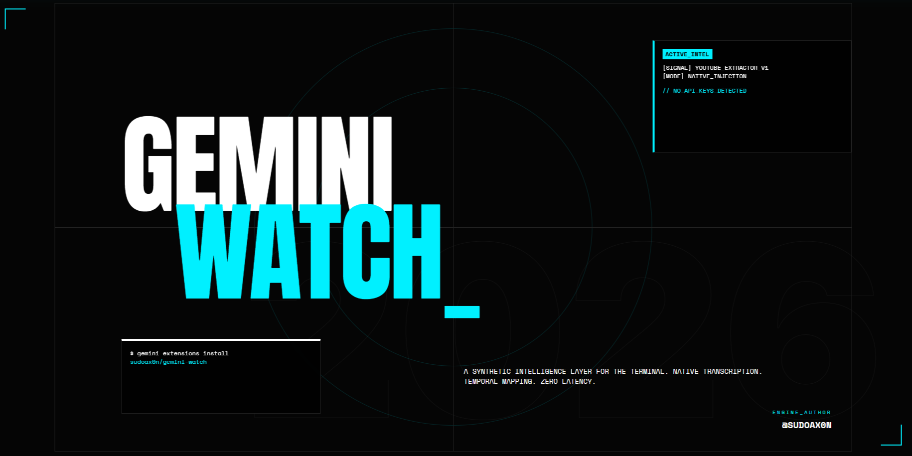
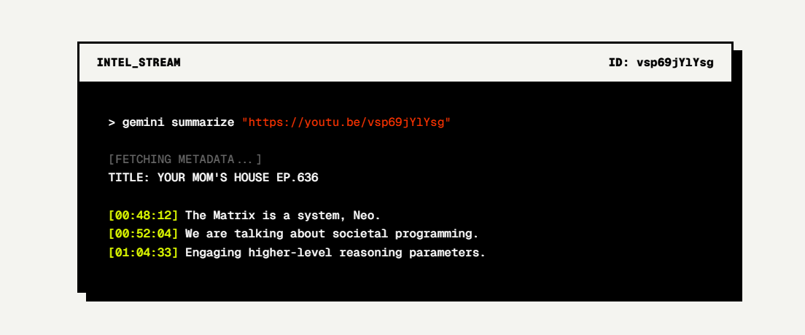

<p align="center">
  
</p>

# Gemini Watch 👁️

**Gemini Watch** is a native, ultra-lightweight extension for the [Gemini CLI](https://github.com/google-gemini/gemini-cli) that gives the agent "eyes" to watch YouTube videos. 

Instead of relying on heavy MCP servers or complex setups, `gemini-watch` provides a simple, zero-friction script that allows the CLI to instantly fetch video transcripts, timestamps, and metadata so it can summarize, analyze, and discuss YouTube content with you.

## ✨ Features
* **Zero-Friction:** No API keys required. No complex server configuration.
* **Timestamps:** Automatically formats transcripts with `[MM:SS]` timestamps so the agent can point you to the exact moment a topic was discussed.
* **Metadata Extraction:** Natively extracts the Video Title and Channel Name to provide immediate context before analyzing the transcript.
* **Auto-Installing Dependencies:** The underlying script automatically installs the necessary Python libraries (`youtube-transcript-api`) on its first run if they are missing.
* **Native Feel:** Designed purely via the `GEMINI.md` instruction model, making it incredibly fast and integrated natively into the agent's workflow.

## 🛠️ Prerequisites

To use this extension, you must have **Python** installed on your system, as the transcript engine is powered by a Python script.

1. Ensure Python 3 is installed and accessible from your terminal (`python` or `py` on Windows).
2. The script will automatically install `youtube-transcript-api` via `pip`, but you can install it manually if you prefer:
   ```bash
   pip install -r requirements.txt
   ```

## 📦 Installation

You can install this extension directly into Gemini CLI using the following command (replace `<your-username>` with your actual GitHub username once published):

```bash
gemini extensions install https://github.com/sudoax0n/gemini-watch
```

*Note: If you have cloned this repository locally, you can link it instead:*
```bash
gemini extensions link ./gemini-watch
```

## 🚀 Usage

Once installed, simply drop a YouTube link into your Gemini CLI session and ask it a question!

**Example Prompts:**
* *"Summarize this video: https://www.youtube.com/watch?v=dQw4w9WgXcQ"*
* *"Extract the key takeaways from this lecture: [URL]"*
* *"At what timestamp did they talk about 'React 19' in this video? [URL]"*

<p align="center">
  
</p>

## 🧠 How it Works
1. When you provide a YouTube URL, the Gemini CLI agent reads the `GEMINI.md` instructions.
2. It extracts the Video ID from your URL.
3. It executes the `scripts/get_transcript.py` tool.
4. The script fetches the Title, Channel, and Timestamped Transcript.
5. The agent uses its massive context window to synthesize and answer your query.

## 🤝 Socials
Follow me for more Gemini CLI tools and hacks:
* **X (Twitter):** [@beyondwudan](https://x.com/beyondwudan)
* **GitHub:** [@sudoax0n](https://github.com/sudoax0n)

## License
[MIT License](LICENSE)

